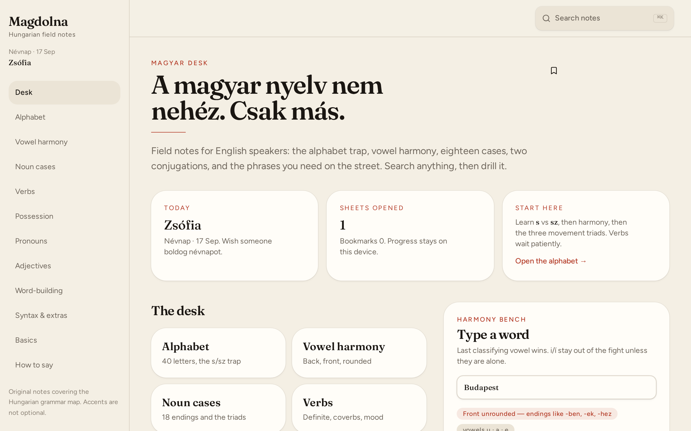
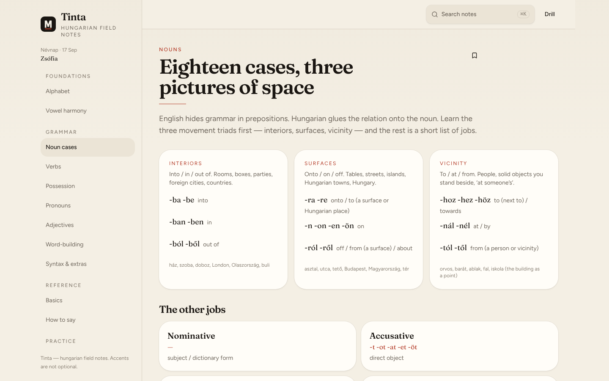
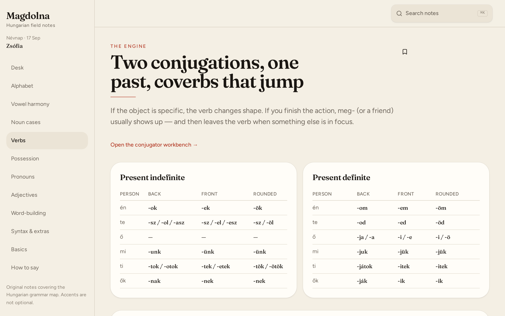
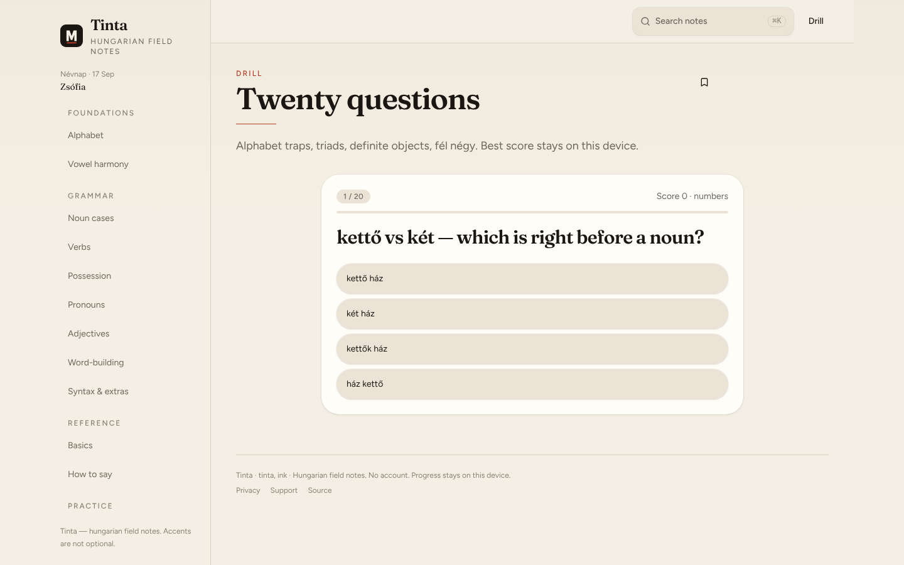

# Tinta

**Hungarian field notes for English speakers.**

A practical grammar notebook for learning the language around you: the alphabet, vowel harmony, eighteen noun cases, verb conjugations, and everyday phrases. _Tinta_ means **ink**. Open a sheet, try the workbench, then test what you learned.

[](https://github.com/rntschlr/berry-brick-flora-bolt/actions/workflows/cloudflare.yml)

[Explore the screenshots](#screenshots) · [Run locally](#local-development) · [Architecture](docs/architecture.md) · [Deploy & connect a domain](docs/deployment.md) · [Contribute](CONTRIBUTING.md)

<p align="center">
  
</p>

## The notebook

| Feature                 | What it does                                                                                 |
| ----------------------- | -------------------------------------------------------------------------------------------- |
| Your desk               | A six-step learning path, today's Hungarian name day, progress, and bookmarked sheets        |
| Grammar reference       | Alphabet, harmony, cases, verbs, possession, pronouns, adjectives, word-building, and syntax |
| Everyday language       | Numbers, time, colours, greetings, and phrases you will actually use                         |
| Interactive workbenches | Explore noun endings, vowel harmony, and verb conjugation                                    |
| Practice drills         | Full or topic-specific quizzes, explanations, mistake review, and targeted retries           |
| Search                  | Find cases, verbs, phrases, and basics with **⌘K / Ctrl+K**                                  |
| Personal progress       | Continue your last sheet; keep bookmarks and your full-drill best in this browser            |

No account is required. Progress is stored in browser `localStorage`; it does not sync across devices or domains. If storage is unavailable, the notebook remains usable for the current session.

## Screenshots

Real application captures, committed with the repository. Click a picture to inspect it at full size.

| The desk                                                                                                               | Noun cases                                                                                                                     |
| ---------------------------------------------------------------------------------------------------------------------- | ------------------------------------------------------------------------------------------------------------------------------ |
| [](docs/screenshots/home.png) | [](docs/screenshots/cases.png) |
| **A place to start.** A warm paper palette, clear navigation, and a structured learning path.                          | **Grammar you can scan.** Related endings sit together with practical examples.                                                |

| Verb reference                                                                                                         | Practice                                                                                                                                 |
| ---------------------------------------------------------------------------------------------------------------------- | ---------------------------------------------------------------------------------------------------------------------------------------- |
| [](docs/screenshots/verbs.png) | [](docs/screenshots/practice.png) |
| **Patterns side by side.** Compare conjugations and jump to the workbench.                                             | **Learn by answering.** Short questions put the reference material into practice.                                                        |

These captures document the original interface. The current desk adds a bookmark shelf and study guidance; the current drill adds topic selection, mistake review, and retries. Those additions are not shown in these reference images.

## Local development

Use **Node 22**, as pinned in [`.nvmrc`](.nvmrc).

```bash
git clone https://github.com/rntschlr/berry-brick-flora-bolt.git
cd berry-brick-flora-bolt
nvm install
nvm use
npm ci
cp .env.example .env.local
npm run dev
```

Open **http://localhost:8080**. Keep the public configuration from [`.env.example`](.env.example): `VITE_AUTH_ENABLED=false`, `VITE_PUBLIC_STANDALONE=true`, and `VITE_SHIP_GROK_CHROME=false`. Never put secrets in a `VITE_` variable; these values can be included in browser code.

Run the same checks used by pull requests:

```bash
npm run typecheck
npm run lint
npm test
NITRO_PRESET=cloudflare-pages npm run build:cf
npm run test:production
```

See [CONTRIBUTING.md](CONTRIBUTING.md) for previewing changes, checking interactions, and updating screenshots.

## Architecture

**The public notebook is a server-rendered application with browser-local progress.** React 19 and TanStack Router/Start provide the interface and routing; Vite 8, Tailwind CSS 4, and Nitro build the application for Cloudflare Pages. Figtree and Fraunces are self-hosted.

The server renders pages and serves the application. Learning content lives in typed source files, and quizzes, bookmarks, and reading progress run in the browser. The repository also retains optional authentication, database, and connector helpers from its original scaffold; the public notebook does not use them for learner data or offer account sync.

The [architecture guide](docs/architecture.md) explains the boundaries, source layout, and what would be needed before adding a persistent backend.

## Deployment & your future domain

The repository includes a Cloudflare Pages workflow. Pull requests run typechecking, lint, tests, a production build, and checks against the built server handler. Uploads are restricted to `main` and require deployment credentials.

Follow the [deployment guide](docs/deployment.md) to create the Pages project, configure GitHub Actions, verify the live site, and connect a custom domain when you have one. Set the GitHub Actions repository variable **`VITE_PUBLIC_SITE_URL`** to your public HTTPS origin and rebuild when the domain changes.

The default configuration names `https://tinta.pages.dev`; that is a deployment target, not confirmation that a live site has been published. Browser progress belongs to its current origin, so moving to a custom domain starts a separate local notebook.

## Project information

- [Contributing](CONTRIBUTING.md)
- [Architecture](docs/architecture.md)
- [Deployment and custom domains](docs/deployment.md)
- [Security reporting](SECURITY.md)
- [Privacy page](src/routes/privacy.tsx)

The product is **Tinta**. `berry-brick-flora-bolt` is the original GitHub repository name. Hungarian name-day data retains real given names.

**License:** no open-source license is granted by this repository unless the owner adds one.
